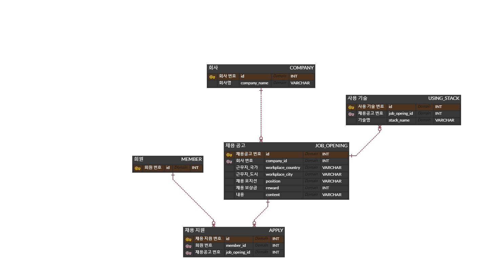

# 원티드 프리온보딩 인턴십-백엔드 과제

## *사용 기술 스택*
- Spring Boot
- Spring Data JPA + QueryDsl
- H2 DB

## *ERD*

## *project issue*
### QueryDsl을 통한 동적 쿼리 처리
- 프로젝트 요구 기능 중 검색어를 통해 채용공고 목록을 조회하는 기능이 있었다.
- 검색어에 대한 조건 처리를 제외하고는, 전체 채용공고 목록을 조회하는 기능과 차이가 없었다.
- 따라서 Controller, Service, Repository 계층에서 검색어 유무에 따른 기능을 구분해서 개발하기 보다는 동적 쿼리를 통해 개발하는 것이 효율적이라고 판단하였다.
- 동적 쿼리 처리를 위해 QueryDsl을 사용하였다.
  - 검색어가 있는 경우 검색어가 회사명, 포지션, 사용 기술에 포함된 채용공고 목록이 조회된다.
  - 검색어가 없는 경우 추가적인 조건 없이 전체 채용공고 목록이 조회된다.